# Probash Care - Your one-step solution for expatriate welfare

**Probash Care** is an innovative mobile application built using Flutter to support **Bangladeshi expatriates**—whether they are students pursuing higher education or workers seeking ethical employment abroad. It provides verified, relevant, and practical resources that make life easier while living overseas.

---

## 🚀 Getting Started

Probash Care helps users navigate the challenges of migration by offering:

- ✅ Verified resources and support for **students** and **job seekers**
- ✅ Visa guidance and legal support for **laborers**
- ✅ Community connection, emergency help, and updates on migration policy

---

## 🔐 User Authentication

### 🔸 Login Page
Users begin by logging into the app using their credentials.  
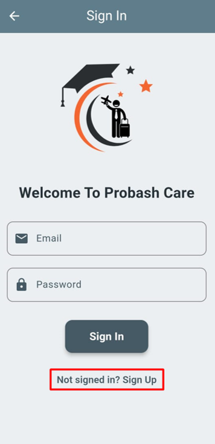

### 🔸 Registration Page
New users can register by filling out necessary information.  

### 🔸 Email Verification Process
After submitting the form, a verification email is sent.  
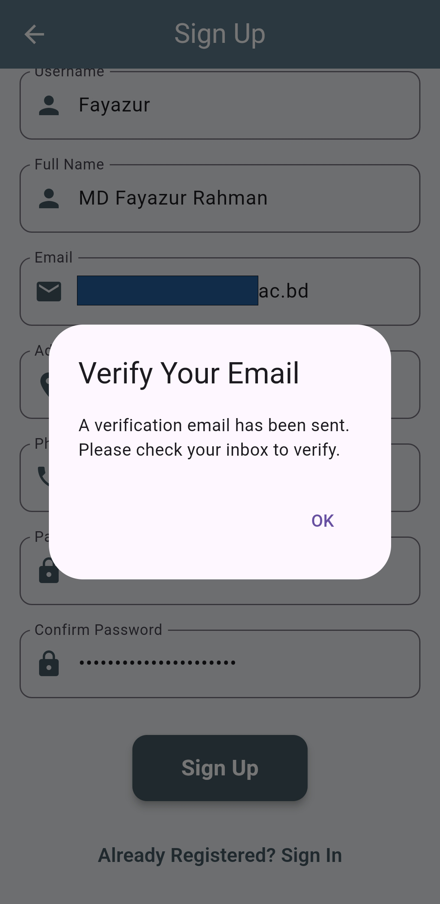  
Click the verification link to confirm the email address.  
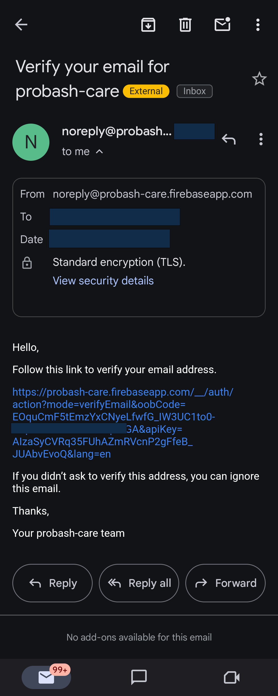  
Successful verification confirmation:  

**Note:** Login is not permitted until email verification is complete.

### 🔸 Access Dashboard
Once verified, users can log in.  
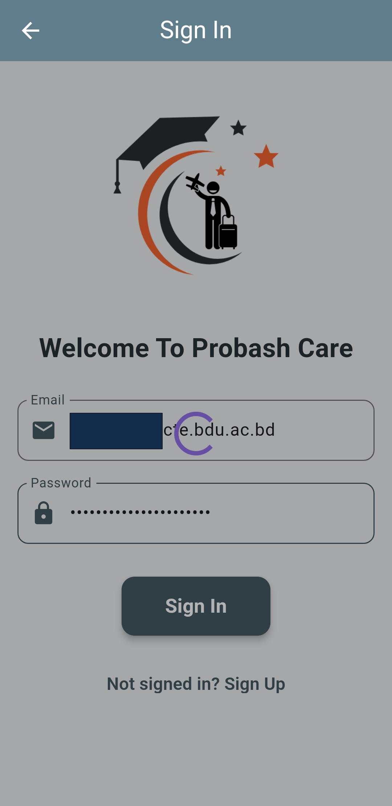  
Here’s the main dashboard after login:  
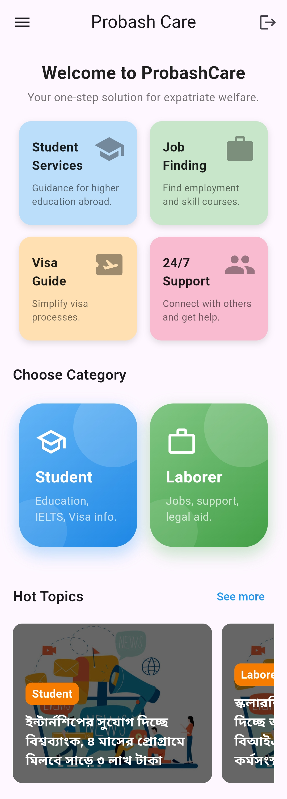

Users can select their category: **Student** or **Laborer**, or explore hot topics such as job or internship updates.

---

## 🎓 Student Services

### 🔸 Search by Country and Degree
Students can select a country and degree to get relevant support.  
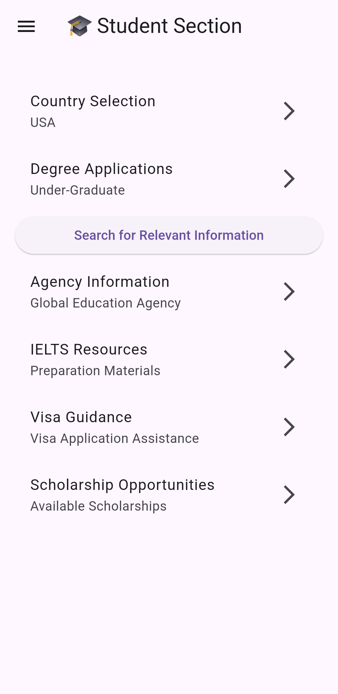

### 🔸 Key Resources Available
- Agency Information
- IELTS Resources
- Visa Guidance
- Scholarship Opportunities

### 🔸 Agency Information View
Filtered agency list:  
  
Detailed view of an agency:  
  
Clicking links will redirect to the agency’s official site:  
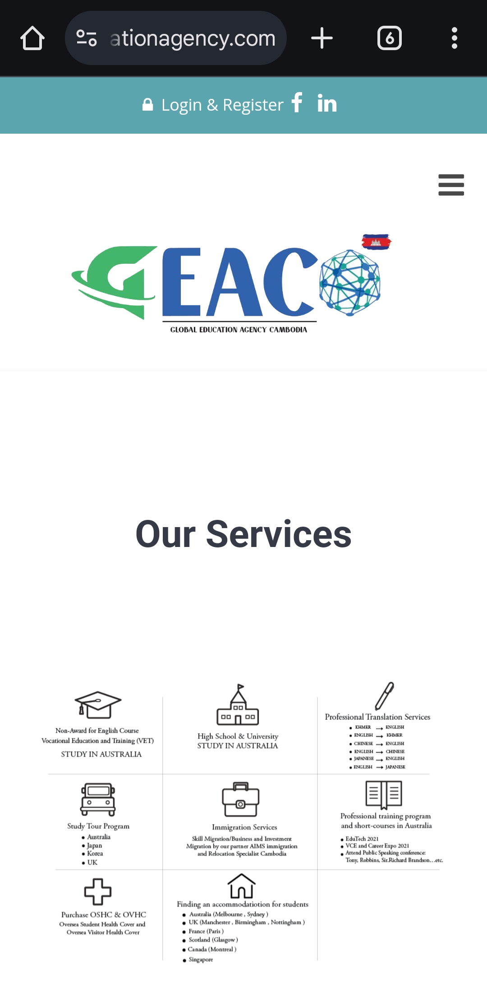

---

## 🛠️ Laborer Support

### 🔸 Search by Country and Job Type
Laborers can explore job opportunities tailored to their preferences.  
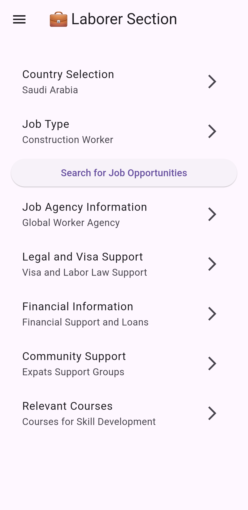

### 🔸 Key Resources Available
- Job Agency Information  
- Legal and Visa Support  
- Financial Information  
- Community Support  
- Relevant Courses

### 🔸 View Relevant Courses
Based on selected job type, courses are shown:  
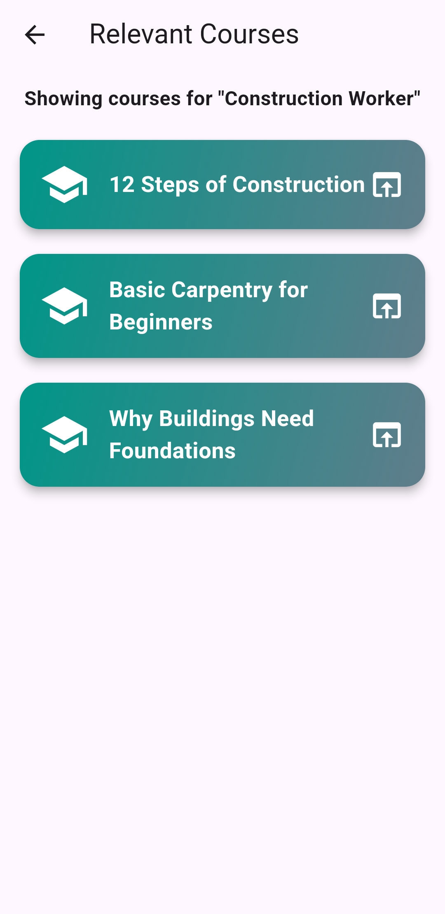  
Example course: "12 Steps of Construction" from YouTube  

Clicking on a course will open it in the browser.

---

## 📋 Side Navigation Menu

The sidebar includes:
- Home
- Students
- Laborers
- Profile
- Provide Feedback
- Logout  
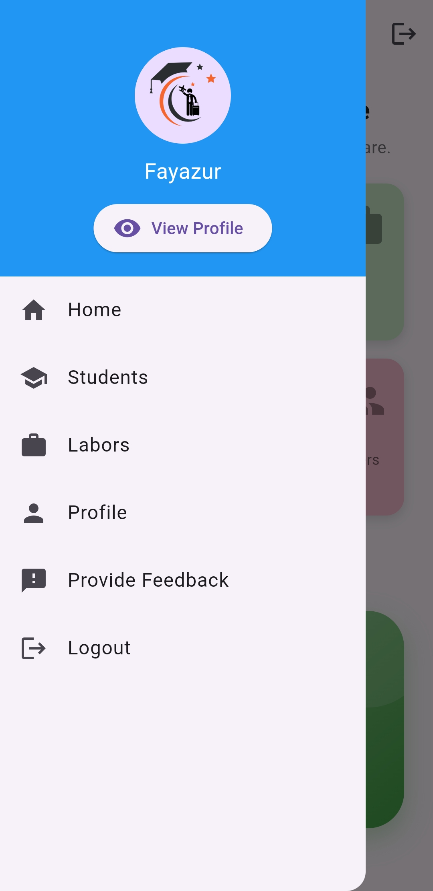

---

## 👤 User Profile

Users can view and edit their personal details here.  
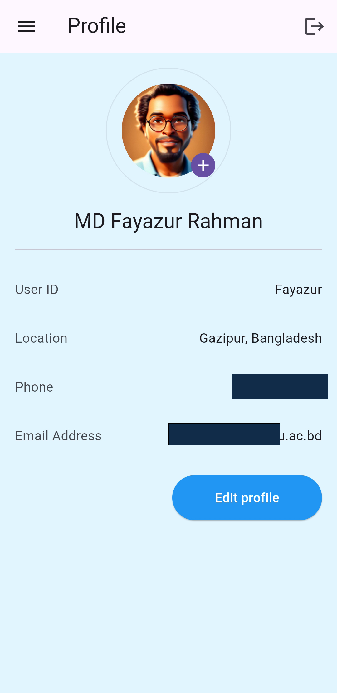

---

## 💬 Feedback Section

Users can share their experience and suggestions.  
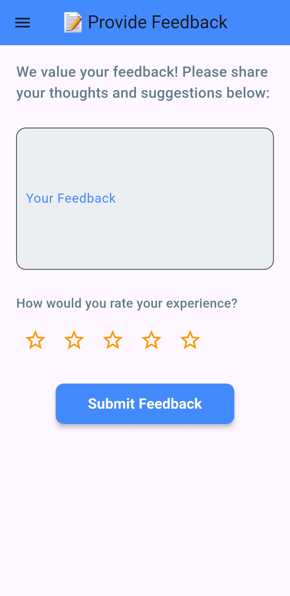

---

## 📱 Built With

- **Flutter** – Frontend Framework  
- **Firebase** – Authentication and Database  
- **Dart** – Programming Language

---

## 🤝 Contributing

Pull requests are welcome. For major changes, please open an issue first to discuss what you would like to change.

---

## 📧 Contact

For support or collaboration:  
**Email:** probashcare.team@example.com  
**Developed By:** Probash Care Team

---

