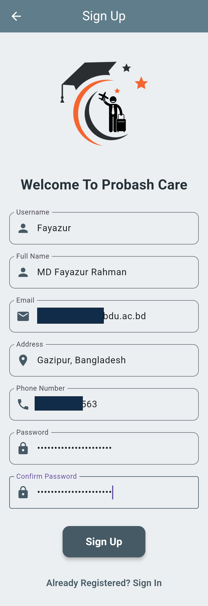
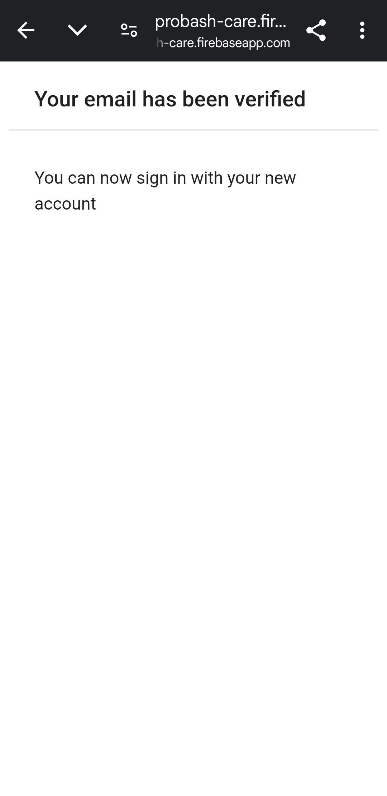
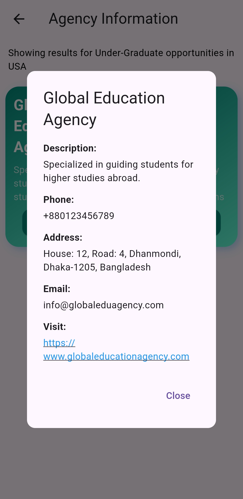

# Probash Care – Your One-Step Solution for Expatriate Welfare

**Probash Care** is an innovative mobile application built using Flutter to support **Bangladeshi expatriates**—whether they are students pursuing higher education or workers seeking ethical employment abroad. It provides verified, relevant, and practical resources that make life easier while living overseas.

---

## 🚀 Getting Started

Probash Care helps users navigate the challenges of migration by offering:

- ✅ Verified resources and support for **students** and **job seekers**  
- ✅ Visa guidance and legal support for **laborers**  
- ✅ Community connection, emergency help, and updates on migration policy  

---

## 🔐 User Authentication

### 🔸 Login & Registration

  
  

Users can log in with existing credentials or register with necessary details by clicking the sign-up button.

---

### 🔸 Email Verification Process

  
  
  

After registering, users receive a verification message. They must confirm their email via the link received in the email. Without this verification, login will not be permitted.

---

### 🔸 Accessing the Dashboard

  
  

Once verified, users can log in and land on the dashboard. From here, they can explore Hot Topics or choose between Student and Laborer services.

---

## 🎓 Student Services

### 🔸 Search Functionality

Students select their desired country and degree type to access customized support.

---

### 🔸 Student Resources Overview

  
  
  

Students can view filtered agency lists, see detailed information for each agency, and access their official websites directly.

Available resources include:
- Verified agencies
- IELTS prep materials
- Visa guidance
- Scholarship info

---

## 🛠️ Laborer Support

### 🔸 Job Search and Resources

Laborers select their target country and job type to view tailored opportunities and support options.

---

### 🔸 Course and Training Resources

  
  

Relevant training courses appear based on job type. For instance, selecting a construction job may suggest a “12 Steps of Construction” YouTube course, linked directly within the app.

---

## 📋 Side Navigation Menu

The app’s sidebar allows access to:
- Home  
- Students  
- Laborers  
- Profile  
- Feedback  
- Logout  

---

## 👤 Profile Management

Users can view and update their profile information directly within the app.

---

## 💬 Feedback System

Users can submit feedback to improve the app and share their experiences.

---

## 📱 Built With

- **Flutter** – Frontend Framework  
- **Firebase** – Authentication and Database  
- **Dart** – Programming Language  

---

## 🤝 Contributing

Pull requests are welcome. For major changes, please open an issue first to discuss the changes you'd like to propose.

---

## 📧 Contact

For support or collaboration:  
**Email:** probashcare.team@example.com  
**Developed By:** Probash Care Team  

---
